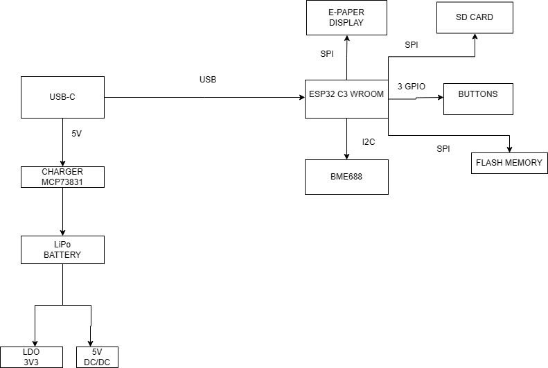

#  README – E-Book Reader

Dispozitivul prezentat este bazat pe microcontrollerul **ESP32-C6**, un cip performant ce oferă conectivitate **WiFi** și interfață **USB** integrate.  
Proiectarea a pornit de la realizarea schemei electronice, urmată de rutarea plăcii PCB și finalizată cu modelarea 3D completă, unde au fost plasate toate componentele hardware și s-a conceput carcasa pentru asamblare eficientă.

---

##  Componente hardware și funcționalitate

Structura hardware este organizată în mai multe module funcționale, fiecare având un rol bine definit.  
Am inclus elemente de interfață precum ecranul și butoanele, dar și senzori, circuite de alimentare și protecție.

Alimentarea dispozitivului se face printr-un conector **USB-C**, care este conectat la un circuit de protecție ESD.  
Tensiunea de 5V este preluată de un încărcător **LiPo** (MCP73831), care gestionează în mod eficient încărcarea unei baterii de 3.7V.  
Aceasta este apoi convertită la 3.3V folosind un stabilizator de tensiune **LDO**, care alimentează toate circuitele sensibile de pe placă.

Această abordare asigură un consum redus de energie, în special în modul **deep sleep**, când doar senzorul de mediu **BME688** rămâne activ, iar restul componentelor sunt oprite pentru a economisi energie.

---

##  Modul ESP32-C6

Microcontrollerul **ESP32-C6** reprezintă centrul de control al sistemului. A fost ales pentru combinația sa de performanță, conectivitate modernă și suport nativ pentru protocoalele esențiale: **SPI**, **I2C** și **GPIO**.

Acesta coordonează:
- Comunicarea cu ecranul e-paper prin SPI
- Butoanele tactile prin GPIO
- Senzorul de mediu prin I2C
- Interfața USB pentru debugging și transfer de date

---

##  Ecranul e-paper

Pentru afișaj, am utilizat un ecran **e-paper de 7.5”**, cunoscut pentru consumul redus de curent – funcționează doar în timpul actualizării imaginii.  
Conectarea se face prin SPI, iar semnalele de control precum **CS**, **DC**, **RST** și **BUSY** sunt mapate către pini GPIO optim aleși pentru o rutare facilă.

---

##  Senzorul BME688

**BME688** este un senzor multifuncțional capabil să măsoare **temperatura**, **umiditatea** și **presiunea atmosferică**.  
Se conectează la ESP32-C6 prin magistrala **I2C**, pe care o poate împărți cu alte dispozitive (ex: modul RTC).  
Este un senzor cu consum extrem de redus, potrivit pentru aplicații care monitorizează constant mediul înconjurător.

---

##  Interfața cu utilizatorul

Sistemul include trei butoane tactile, fiecare conectat la un pin **GPIO** diferit.  
Pentru a preveni contactele instabile, s-a implementat **debounce hardware** folosind combinații rezistor–condensator (filtru RC).  
Unul dintre butoane este conectat la **GPIO0**, esențial pentru modul de boot al ESP32, iar celelalte sunt distribuite pe pini standard.

---

## 🔌 Alegerea pinilor

Selectarea pinilor s-a făcut în funcție de:
- Simplitatea rutării pe placa PCB
- Compatibilitatea cu funcțiile implicite ale microcontrollerului

# BOM TSC – Lista de componente

| Nr. piesa | Nume piesa | Site | Datasheet |
| --- | --- | --- | --- |
| 1 | BOOT_BUTON | https://www.snapeda.com/parts/EVQP7L01P/Panasonic%20Electronic%20Components/view-part/?welcome=home | https://www.snapeda.com/parts/EVQP7L01P/Panasonic/datasheet/ |
| 2 | C1, C1_BAT, C1_BAT2, C2,C2_BAT,C3,C4,C4_USB, C5, C5_USB, C6, C7, C8, C9,C10 | https://componentsearchengine.com/part-view/CC0402MRX5R5BB106/YAGEO | https://componentsearchengine.com/Datasheets/2/CC0402MRX5R5BB106.pdf |
| 3 | C10_SUPERCAR | https://industry.panasonic.com/global/en/products/control/switch/light-touch/number/evqpuj02k | https://industry.panasonic.com/global/en/downloads?tab=catalog&small_g_cd=203&part_no=EVQPUJ02K |
| 4 | CHANGE_BUTTON | https://www.snapeda.com/parts/EVQP7L01P/Panasonic%20Electronic%20Components/view-part/?welcome=home | https://www.snapeda.com/parts/EVQP7L01P/Panasonic/datasheet/ |
| 5 | C_DELAY | https://componentsearchengine.com/part-view/CC0402MRX5R5BB106/YAGEO | https://componentsearchengine.com/Datasheets/2/CC0402MRX5R5BB106.pdf |
| 6 | D1 | https://www.snapeda.com/parts/USBLC6-2SC6Y/STMicroelectronics/view-part/?ref=eda | https://www.snapeda.com/parts/USBLC6-2SC6Y/STMicroelectronics/view-part/?ref=eda |
| 7 | EPD_C1,EPD_C2, EPD_C3, EPD_C4, EPD_C5,EPD_C6,EPD_C7,EPD_C8,EPD_C9,EPD_C10,EPD_C11,EPD_C12 | https://componentsearchengine.com/part-view/CC0402MRX5R5BB106/YAGEO | https://componentsearchengine.com/Datasheets/2/CC0402MRX5R5BB106.pdf |
| 8 | IC1 | https://componentsearchengine.com/part-view/BD5229G-TR/ROHM%20Semiconductor | https://datasheet.datasheetarchive.com/originals/distributors/Datasheets_SAMA/f2b9741ef86007909f138d561a359946.pdf |
| 9 | IC4 | https://componentsearchengine.com/part-view/XC6220A331MR-G/Torex | https://product.torexsemi.com/system/files/series/xc6220.pdf |
| 10 | J1 | https://componentsearchengine.com/part-view/FH34SRJ-24S-0.5SH(99)/Hirose | https://www.hirose.com/en/product/document?clcode=CL0580-1255-6-99&productname=FH34SRJ-24S-0.5SH(99)&series=FH34SRJ&documenttype=2DDrawing&lang=en&documentid=0000990903 |
| 11 | J2 | https://componentsearchengine.com/part-view/USB4110-GF-A/GCT%20(GLOBAL%20CONNECTOR%20TECHNOLOGY) | https://gct.co/files/drawings/usb4110.pdf |
| 12 | J3,J4 | https://www.snapeda.com/parts/PRT-14417/SparkFun/view-part/ | https://www.snapeda.com/parts/PRT-14417/SparkFun%20Electronics/datasheet/ |
| 13 | MCP73831 | https://ro.mouser.com/ProductDetail/Microchip-Technology/MCP73831T-2ACI-OT?qs=yUQqVecv4qvbBQBGbHx0Mw%3D%3D&utm_id=20109199409&utm_source=google&utm_medium=cpc&utm_marketing_tactic=emeacorp&gad_source=1&gbraid=0AAAAADn_wf0-USzm1eg1ywGvQg_qMgG3H | https://ro.mouser.com/datasheet/2/268/MCP73831_Family_Data_Sheet_DS20001984H-3441711.pdf |
| 14 | L1 | https://ro.mouser.com/ProductDetail/Wurth-Elektronik/744043680?qs=PGXP4M47uW6VkZq%252BkzjrHA%3D%3D | https://www.we-online.com/components/products/datasheet/744043680.pdf |
| 15 | PFMF.050.1 | https://ro.mouser.com/ProductDetail/EPCOS-TDK/B72520T0350K062?qs=dEfas%2FXlABIszF52uu7vrg%3D%3D | https://www.tdk-electronics.tdk.com/inf/75/db/CTVS_14/Surge_protection_series.pdf |
| 16 | Q1,Q2 | https://componentsearchengine.com/part-view/DMG2305UX-7/Diodes%20Incorporated | https://www.diodes.com//assets/Datasheets/DMG2305UX.pdf |
| 17 | Q3 | https://componentsearchengine.com/part-view/SI1308EDL-T1-GE3/Vishay | https://componentsearchengine.com/part-view/SI1308EDL-T1-GE3/Vishay |
| 18 | Rezistente | https://componentsearchengine.com/part-view/R0402%201%25%20100%20K%20(RC0402FR-07100KL)/YAGEO | https://www.yageo.com/upload/media/product/products/datasheet/rchip/PYu-RC_Group_51_RoHS_L_12.pdf |
| 19 | RESET_BUTTON | https://www.snapeda.com/parts/EVQP7L01P/Panasonic%20Electronic%20Components/view-part/?welcome=home | https://www.snapeda.com/parts/EVQP7L01P/Panasonic/datasheet/ |
| 20 | R_BOOT | https://componentsearchengine.com/part-view/R0402%201%25%20100%20K%20(RC0402FR-07100KL)/YAGEO | https://www.yageo.com/upload/media/product/products/datasheet/rchip/PYu-RC_Group_51_RoHS_L_12.pdf |
| 21 | R_CAPACITOR | https://componentsearchengine.com/part-view/R0402%201%25%20100%20K%20(RC0402FR-07100KL)/YAGEO | https://www.yageo.com/upload/media/product/products/datasheet/rchip/PYu-RC_Group_51_RoHS_L_12.pdf |
| 22 | R_CHANGE | https://componentsearchengine.com/part-view/R0402%201%25%20100%20K%20(RC0402FR-07100KL)/YAGEO | https://www.yageo.com/upload/media/product/products/datasheet/rchip/PYu-RC_Group_51_RoHS_L_12.pdf |
| 23 | R_CL1 | https://componentsearchengine.com/part-view/R0402%201%25%20100%20K%20(RC0402FR-07100KL)/YAGEO | https://www.yageo.com/upload/media/product/products/datasheet/rchip/PYu-RC_Group_51_RoHS_L_12.pdf |
| 24 | R_RESET | https://componentsearchengine.com/part-view/R0402%201%25%20100%20K%20(RC0402FR-07100KL)/YAGEO | https://www.yageo.com/upload/media/product/products/datasheet/rchip/PYu-RC_Group_51_RoHS_L_12.pdf |
| 26 | SENSOR2 | https://www.snapeda.com/parts/BME680/Bosch/view-part/?welcome=home | https://www.snapeda.com/parts/BME680/Bosch%20Sensortec/datasheet/ |
| 27 | SJ1 | https://grabcad.com/library/solder-jumpers-1 | https://grabcad.com/library/solder-jumpers-1 |
| 28 | U1 | https://www.snapeda.com/parts/W25Q512JVEIQ/Winbond+Electronics/view-part/?ref=eda | https://www.snapeda.com/parts/W25Q512JVEIQ/Winbond+Electronics/view-part/?ref=eda |
| 29 | U2 | https://www.snapeda.com/parts/ESP32-C6-WROOM-1-N8/Espressif+Systems/view-part/?ref=eda | https://www.snapeda.com/parts/ESP32-C6-WROOM-1-N8/Espressif%20Systems/datasheet/ |
| 30 | U3 | https://www.snapeda.com/parts/DS3231SN%23/Analog+Devices/view-part/?ref=eda | https://www.snapeda.com/parts/DS3231SN%23/Analog%20Devices/datasheet/ |
| 31 | U4 | https://www.snapeda.com/parts/MAX17048G+T10/Analog+Devices/view-part/?ref=eda | https://www.snapeda.com/parts/MAX17048G+T10/Analog%20Devices/datasheet/ |

